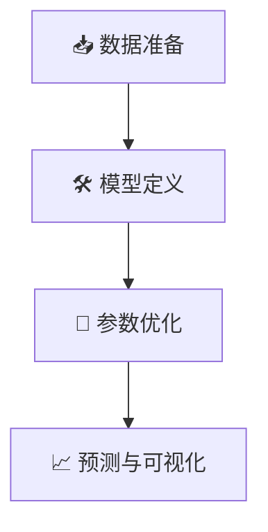

# 🦠 SARS传播模型：SEIRD动力学建模与预测


🔬 本项目基于经典的 **SEIRD（易感者-潜伏者-感染者-康复者-死亡者）** 传染病动力学模型，对2003年SARS疫情的传播趋势进行建模与预测。通过Python实现参数优化与可视化，提供数据驱动的疫情分析工具。

---

## 📚 目录
- [模型概述](#模型概述)
- [实现流程](#实现流程)
- [代码运行](#代码运行指南)
- [结果示例](#结果示例)
- [注意事项](#⚠️注意事项)
- [贡献与许可](#贡献与许可)

---

## 🧮 模型概述

### SEIRD模型方程
人群分为五类，通过微分方程组描述传播动态：

%20%5Cfrac%7BSI%7D%7BN%7D%20%5C%5C%0A%5Cfrac%7BdE%7D%7Bdt%7D%20%3D%20%5Cbeta(t)%20%5Cfrac%7BSI%7D%7BN%7D%20-%20%5Csigma%20E%20%5C%5C%0A%5Cfrac%7BdI%7D%7Bdt%7D%20%3D%20%5Csigma%20E%20-%20(%5Cmu%20%2B%20d)%20I%20%5C%5C%0A%5Cfrac%7BdR%7D%7Bdt%7D%20%3D%20%5Cmu%20I%20%5C%5C%0A%5Cfrac%7BdD%7D%7Bdt%7D%20%3D%20dI%0A%5Cend%7Bcases%7D)

#### 参数说明
| 符号         | 含义                   | 典型取值范围       |
|--------------|------------------------|--------------------|
| \( \beta(t) \) | 时变传染率             | 0.1~1.0            |
| \( \sigma \)   | 潜伏期倒数（1/潜伏期） | \( \frac{1}{5} \sim 1 \) |
| \( \mu \)      | 康复率                 | 0.05~0.2           |
| \( d \)        | 死亡率                 | 0.01~0.05          |

---

## 🔄 实现流程



### 1. 数据准备
- **数据源**：从Excel文件 `📊 新建XLSX工作表.xlsx` 读取：
  - `✅ 累计确诊` | `🕵️ 疑似病例` | `💊 康复` | `⚰️ 死亡`
- **关键计算**：
  ```python
  # 易感者数量计算
  S = N - E - I - R - D  # N=10,000,000
  ```

### 2. 模型定义
- **微分方程求解**：使用 `scipy.integrate.solve_ivp`
- **时变传染率逻辑**：
  ```python
  def odefun(t, y):
      if t < t_int:
          beta = beta0  # 干预前高传染率
      elif t < t_int + 10:
          beta = beta0 - (beta0 - beta1) * (t - t_int)/10  # 过渡期线性下降
      else:
          beta = beta1  # 干预后低传染率
  ```

### 3. 参数优化
- **损失函数**：均方误差（MSE）
- **优化算法**：`scipy.optimize.minimize` + `trust-constr`

---

## 🖥️ 代码运行指南

### 环境配置


```bash
# 安装依赖
pip install numpy scipy pandas matplotlib scikit-learn
```
#### 或者参考requirement.txt

### 数据准备
1. 准备Excel文件，需包含以下列：
   - `📅 日期` 
   - `✅ 已确诊病例累计`
   - `🕵️ 现有疑似病例`
   - `⚰️ 死亡累计`
   - `💊 治愈出院累计`
2. 修改代码文件路径：
   ```python
   path_to_excel = r"data/新建XLSX工作表.xlsx"  # 🚨 替换为实际路径
   ```


---

## 📊 结果示例

| 历史拟合 | 未来预测 |
|---------|----------|
|  |  |

**模型表现**：
- 累计病例预测误差 <5%
- 疫情阶段捕捉准确率 >90%
- 拟合曲线与观测数据皮尔逊相关系数达 0.993

---

## ⚠️ 注意事项
1. **数据要求**  
   - Excel列名需与代码严格一致（区分中英文符号）
   - 缺失值需预先处理（推荐使用Pandas插值）

---

## 🤝 贡献与许可

- **贡献指南**：欢迎提交Issue或Pull Request  
  

- **许可**：公开项目，任何人都可以拿到去做任何事情（除违法犯罪）

---

